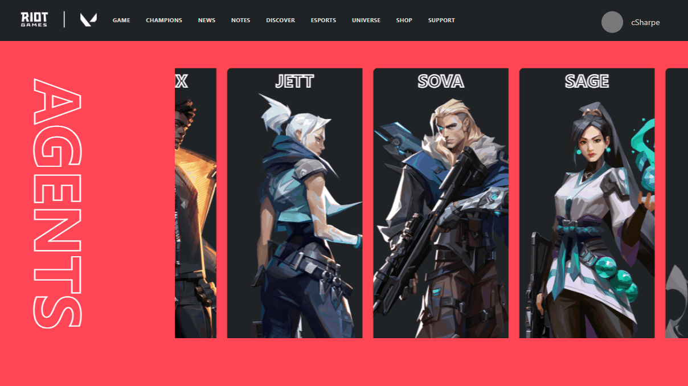
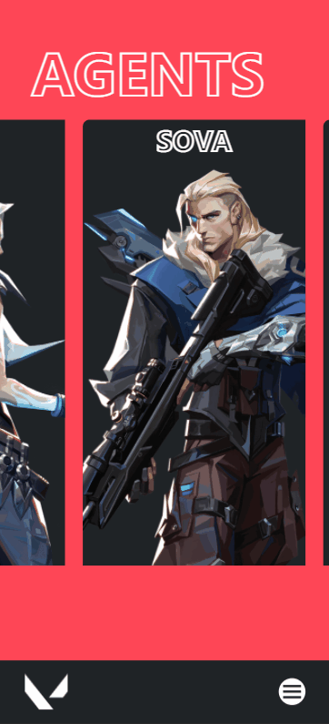

<h4 align="center"> 
	🚧  React Select 🚀 Em construção...  🚧
</h4>

<h1 align="center">
 
valorant agents
</h1>

desenvolvido com typescript e Reactjs

  <h1>1280x720(desktop)</h1>
  
  

  <h1>812x375(iphone-x)</h1>
  

## 🚀 Tecnologias

esse projeto foi desenvolvido com as seguintes tecnologias:

- ✔️ Typescript

- ✔️ ReactJs

- ✔️ Styled-components

- ✔️ styled-icons

como usar:
  # digite os seguites comandos:
  ### `git clone git@github.com:julio-terra/valorant-agents.git`
  ### `cd valorant-agents`
  ### `yarn start`
